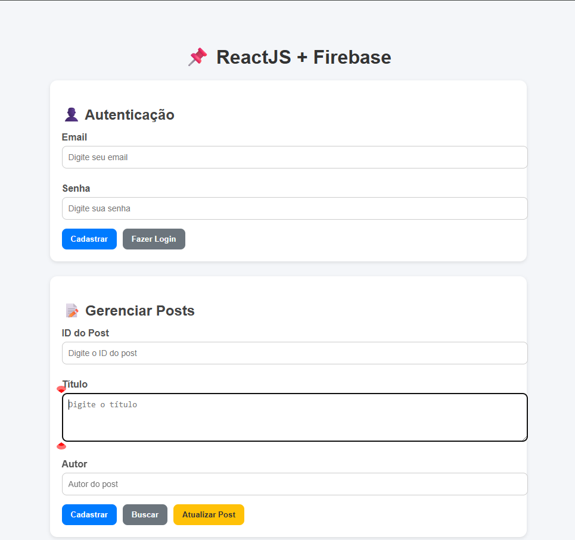

# Projeto Firebase React




Este é um projeto de teste utilizando **React** com **Firebase** (Firestore + Auth), configurado para usar variáveis de ambiente em um arquivo `.env`.

## 🚀 Tecnologias
- React
- Firebase (Firestore e Auth)
- Variáveis de ambiente (.env)

---

## 📂 Estrutura do Projeto
```
src/
  ├── firebaseConnection.js   # Conexão com o Firebase usando variáveis de ambiente
  ├── App.js                  # Arquivo principal React
.env                          # Arquivo com as credenciais (não versionado)
.env.example                  # Exemplo das variáveis de ambiente
```

---

## ⚙️ Configuração

1. Clone este repositório:
```bash
git clone https://github.com/seu-usuario/seu-repo.git
cd seu-repo
```

2. Instale as dependências:
```bash
npm install
# ou
yarn install
```

3. Crie um arquivo `.env` na raiz do projeto baseado no `.env.example`:
```env
REACT_APP_API_KEY=
REACT_APP_AUTH_DOMAIN=
REACT_APP_PROJECT_ID=
REACT_APP_STORAGE_BUCKET=
REACT_APP_MESSAGING_SENDER_ID=
REACT_APP_APP_ID=
REACT_APP_MEASUREMENT_ID=
```

> **⚠️ Nunca suba seu `.env` real para o Git.**  
> Apenas o `.env.example` deve ser versionado.

4. Rode o projeto em modo de desenvolvimento:
```bash
npm start
# ou
yarn start
```

---

## 🔑 Arquivo firebaseConnection.js

```javascript
import { initializeApp } from "firebase/app";
import { getFirestore } from "firebase/firestore";
import { getAuth } from "firebase/auth";

const firebaseConfig = {
    apiKey: process.env.REACT_APP_API_KEY,
    authDomain: process.env.REACT_APP_AUTH_DOMAIN,
    projectId: process.env.REACT_APP_PROJECT_ID,
    storageBucket: process.env.REACT_APP_STORAGE_BUCKET,
    messagingSenderId: process.env.REACT_APP_MESSAGING_SENDER_ID,
    appId: process.env.REACT_APP_APP_ID,
    measurementId: process.env.REACT_APP_MEASUREMENT_ID,
};

const firebaseApp = initializeApp(firebaseConfig);

const db = getFirestore(firebaseApp);
const auth = getAuth(firebaseApp);

export { db, auth };
```

---

## 📌 Notas
- Este projeto é apenas um teste de integração com Firebase.  
- Ajuste o código conforme sua necessidade (ex: autenticação, CRUD, etc).

---

📄 Licença livre para estudo e testes.

## 💻 Desenvolvido por iStudioJS

<iStudioJS /> — Transformando ideias em código! 🚀  
